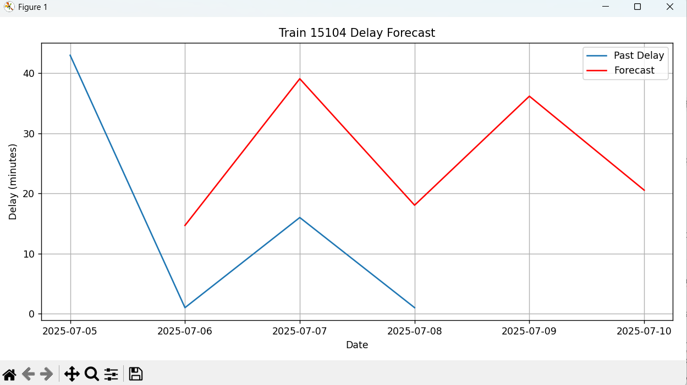

# 🚆 Train Delay Forecasting using ARIMA

A time series forecasting project that predicts train delays for **Train 15104** using historical delay data and the ARIMA model.  
Built with a clean dataset and visualized predictions to help analyze train punctuality trends.

---

## 📌 Project Overview

| Feature              | Description                                            |
|----------------------|--------------------------------------------------------|
| 📊 Model Used        | ARIMA (Auto-Regressive Integrated Moving Average)     |
| 🧹 Data Cleaning     | Converts delay formats like `1 hr 16 min` → `76 min`   |
| 📅 Time Series Index | Uses `Date` as index for forecasting                   |
| 📈 Output            | Forecast delay for the next 5 days                     |
| ⚙️ Libraries Used     | `pandas`, `statsmodels`, `matplotlib`                 |

---

## 🖼️ Sample Output Graph



> 📌 *This graph shows past delay data (blue) and ARIMA-based forecast (red) for upcoming days.*

---

## 📁 Project Structure

train-delay-forecast/

│

├── train_delay_forecast.py # Python script for forecasting

├── train_15104_delay_history.csv # Historical delay dataset

├── forecast_output.png # Output graph (screenshot)

├── README.md # This file


---

## ⚙️ How to Run

Make sure Python and required libraries are installed.

```bash
pip install pandas matplotlib statsmodels
python train_delay_forecast.py
```

## 🔍 Sample Forecast Output

📊 Forecasted Delay (in minutes) for next 5 days:

2025-07-10   = 45.3  
2025-07-11   = 43.2  
2025-07-12   = 47.1  
2025-07-13   = 50.0  
2025-07-14   = 52.5


## 🌟 Future Scope
Add real-time train delay data via APIs

Predict delays using external factors (weather, time, location)

Use advanced ML models like LSTM or Facebook Prophet


## 👩‍💻 Developed By
Radha Maddeshiya

🎓 Final Year B.Tech (Data Science)

📍 Buddha Institute of Technology, GIDA, Gorakhpur
